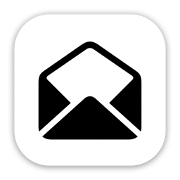

<p align="center">
  
  <h1 align="center">MessAuto</h1>
  <h4 align="center"> 自动提取Mac平台的短信和邮箱验证码</h4>
  <h4 align="center"> Automatic extraction 2FA code for Mac platform</h4>
<p align="center">
<a href="https://github.com/LeeeSe/MessAuto/blob/master/LICENSE.txt">
</a>
<a href="https://github.com/LeeeSe/MessAuto/releases">
</a>
<a href="https://img.shields.io/badge/-macOS-black?&logo=apple&logoColor=white">
</a>
</p>

<p align="center">
  [<a href="./README.md">中文</a>] [<a href="docs/README-EN.md">English</a>]<br>
</p>

# MessAuto

MessAuto 是一款 macOS 平台自动提取短信和邮箱验证码的软件，由 Rust 开发，适用于任何 App

下面展示了在 MessAuto 的辅助下完成短信登录的过程

https://github.com/LeeeSe/MessAuto/assets/44465325/6e0aca37-377f-463b-b27e-a12ff8c1e70b

🎉🎉🎉 MessAuto 现在支持邮件 App

https://github.com/LeeeSe/MessAuto/assets/44465325/33dcec87-61c4-4510-a87c-ef43e69c4e9d

## 使用方法
### 下载并安装
从 release [下载](https://github.com/LeeeSe/MessAuto/releases/latest)
### 授权
- 完全磁盘访问权限：设置 -> 隐私与安全性 -> 完全磁盘访问权限
- 辅助功能权限：设置 -> 隐私与安全性 -> 辅助功能权限
### 将信息和邮件 App 常驻后台
常驻后台可以缩短消息从 iPhone 同步到 Mac 所花时间

## 配置说明
- 自动粘贴：将剪贴板中的验证码模拟键盘自动粘贴到输入框内
- 自动回车：在自动粘贴验证码后再帮你按下回车键
- 不占用剪贴板： MessAuto 会模拟键盘直接输入验证码，不再占用剪贴板
- 监听短信：开启后将同时监听 Mac 自带的信息客户端（App 常驻后台效果最好，否则会延迟响应，非 MessAuto 的问题）
- 监听邮件：开启后将同时监听 Mac 自带的邮件客户端（同上）
- 隐藏图标：暂时隐藏菜单栏图标，App 重启后将再次显示（可用活动监视器 kill 掉）
- 配置：快速打开 TOML 格式的配置文件，可自定义正则及关键词
- 日志：快速打开日志
- 悬浮窗：获得验证码时自动在光标周围弹窗，将强制设定为 “不占用剪贴板” 状态

> 关键词: 也叫触发词，当信息中包含如“验证码”等关键词时，程序才会执行一系列后续操作，否则会忽略此条信息

## 常见问题
### 无法打开，因为无法验证开发者
两种解决方案，推荐第二种
- 打开访达并找到 MessAuto.app，右键打开
- 终端执行 `sudo spctl --master-disable`；设置->隐私与安全性->允许以下来源的应用程序->任何来源

## TODO

- [x] 添加应用内更新
- [x] 优化验证码提取逻辑
- [ ] 发布到 Homebrew
- [ ] 支持第三方邮件客户端
- [ ] 支持 Android 和 Windows

## 开发

```bash
# 下载源码
git clone https://github.com/LeeeSe/MessAuto.git
cd MessAuto

# 编译运行（非必需，仅用于开发测试）
cargo run

# 安装 cargo-packager
cargo install cargo-packager --locked
# 编译
cargo build --release
# 打包应用
cargo packager --release
```

生成的 MessAuto 应用位于 `target/release/MessAuto.app`。

## 感谢

- 感谢 [@尚善若拙](https://sspai.com/post/73072) 提供获取短信思路
